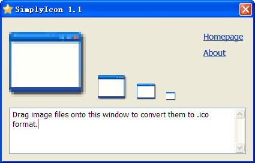

SimplyIcon
==========
Simply create windows icon files (.ICO format) by drag-and-drop images on to this program. 
This program generates down-sampled 32x32, 24x24 and 16x16 levels automatically. 
It will also generate the 128x128 level if your source image is equal to or larger than 128x128. 

## Download
[SimplyIcon 1.1](SimplyIcon.zip) - .NET Framework 2.0

-------------------------

