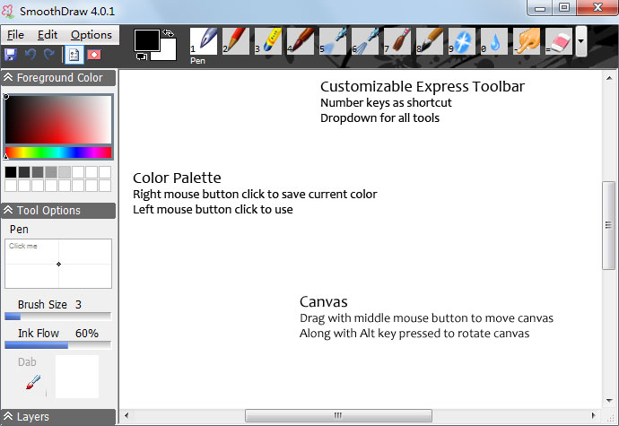

SmoothDraw
==========
SmoothDraw is an easy natural painting and digital free-hand drawing software that can produce high quality pictures. 
Support many kinds of brushes (pen, pencil, dry media, airbrush, bristle brush, image hose, etc.), retouch tools, layers, etc.

## Download
* [SmoothDraw 4.1.4 Beta (zip 2MB)](SmoothDraw4Beta.zip) - Win 7 SP1, Win 8/8.1/10, .NET Framework 4.6
* [SmoothDraw 4.0.5 (zip 2MB)](SmoothDraw4.zip) - XP SP3/Vista SP1/Win7, .NET Framework 4.0

## Version History
New for 4.1.4 beta
* Changed brush cross-hair cursor to pen cursor, which is more visible on HD display.

New for 4.1.3 beta
* Removed the feature of temporarily switch to eyedropper when pressing Ctrl key when using brush, because quite a few users have issue with it.
* Enabled .json based localization for resize dialog.
* Add Ctrl+Shift+Z for redo, in addition to Ctrl+Y.
* Greek localization files provided by geogeo.gr.

New for 4.1.2 beta
* Convert remaining dialogs to WPF so that they work well on high DPI display.
* Hatch brush is back.
* .NET Framework 4.6 is now used.

New for 4.1.1 beta
* Main window is rewritten with WPF, so should work for high DPI display.

New for 4.1.0 beta
* Removed dependency on WinTab32, which is the old tablet device interface. Now it uses Windows system's ink device support, which should have better compatibility with various types of input devices.
* New paint window UI, which is written on top of WPF. Going this path paves the way to support Windows 10 devices in future.

New for 4.0.5
* Draw straight lines by holding Shift key. (Experimental)

New for 4.0.4
* Fix .sddoc save/load failure. This bug is introduced by a build time tool which is used since version 4. This means .sddoc files saved by 4.0.1 - 4.0.3 cannot be opened by other versions. You have to resave files in an other format so that other version can open them.

New for 4.0.3
* Shortcut key for colors in palette

New for 4.0.2
* Bring back shortcut keys for copy/paste

New for 4.0.1
* New design direction and new UI
* Localization by JSON files (Anyone now can create translations by copying and modifying these JSON text files. Just put them in a subfolder named after ISO culture name. E.g. de-DE, fr-FR, ru-RU.)
* Upgraded to .NET Framework 4.0
